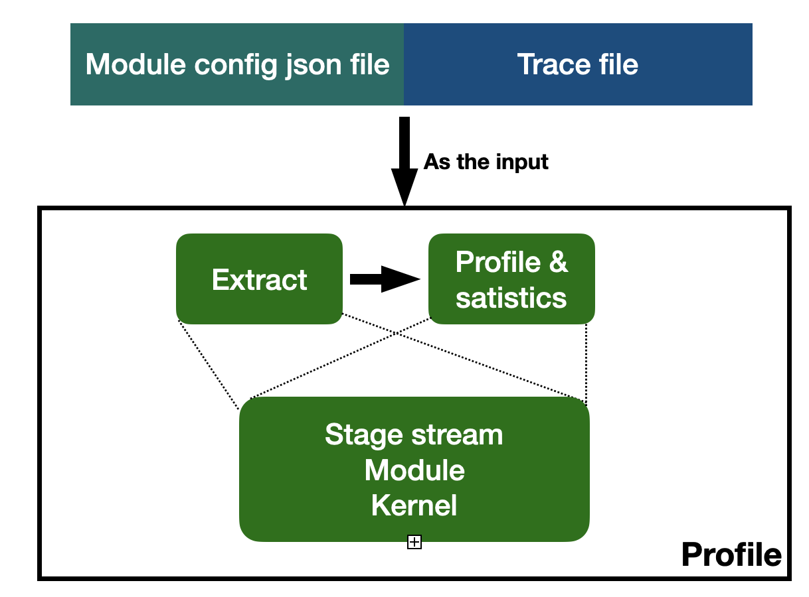

This is the part for the microbenchmark profile. Our microbenchmark is focus on breakdown the entire process of the LLM training. And we try to figure out the truly benefit of the recomputation and flash-attention.

### Analysis workflow

